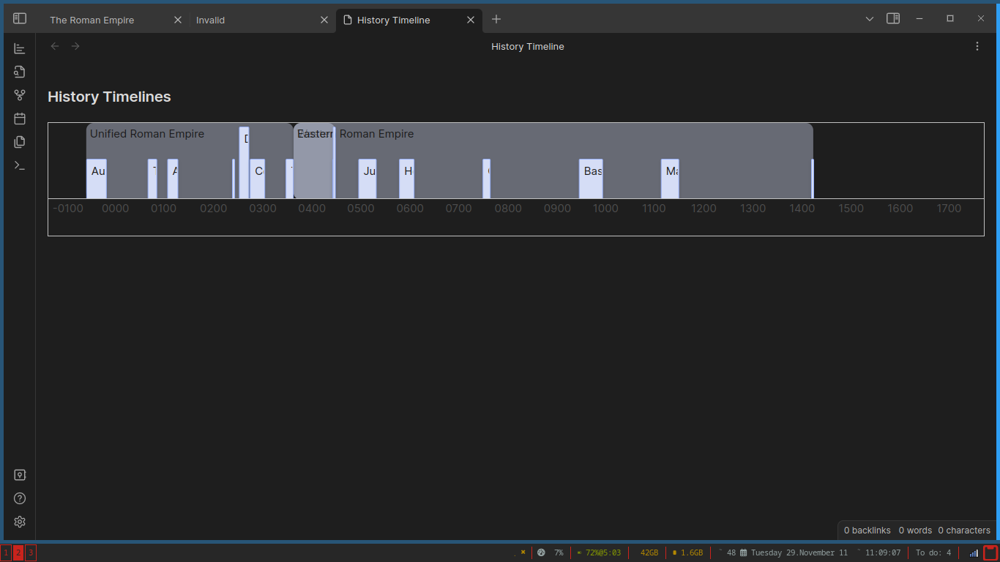

# History Timelines
Generate a chronological timeline of all notes in chronological order.
This is a fork of [Darakah's Timelines](https://github.com/Darakah/obsidian-timelines) plugin



## Syntax
``````yaml
```tl
# This notation is in YAML
date: 2022-11-26

# Optional
end: -002022 # If you are going to be using negative years, make the year have six digits, otherwise it will be registered as positive (this is a problem of the Date class in JS)
color: yellow # accepts HTML color codes and hex colors
image: image.png # Adds an image into the timeline, can be automaticaly fetched when using the Banner plugin
title: Example title # Custom title, the note name is used when not provided
type: period # Options: box, range, background, point
group: example # You can group events together
```
``````

## Development

You will need NodeJS and NPM

Install dependencies
```bash
npm i
```

Compile dev version
```bash
npm run dev
```

Compile build version
```bash
npm run build
```

## TODO:
- Better css
- Make color option do something
- Timeline block intelisense

## Licence

Licenced under the [MIT License](https://mit-license.org/).
